- [中文](README.zh.md)
- [English](README.md)

# कोड संरचना

```
lib/
├── app.dart                 # एप्लिकेशन प्रवेश और वैश्विक कॉन्फ़िगरेशन
├── main.dart               # मुख्य प्रोग्राम प्रवेश
├── firebase_options.dart   # Firebase कॉन्फ़िगरेशन
├── common/                 # सामान्य कंपोनेंट और उपयोगिताएँ
├── data/                   # डेटा मॉडल और स्टेट प्रबंधन
├── firestore/             # Firestore डेटाबेस ऑपरेशन
├── kits/                  # ZEGO UI Kits एकीकरण
│   ├── call/             # कॉल कार्यक्षमता
│   │   ├── call_page.dart        # कॉल पेज
│   │   ├── call_invitation.dart  # कॉल आमंत्रण
│   │   └── call_settings.dart    # कॉल सेटिंग्स
│   ├── live_streaming/   # लाइव स्ट्रीमिंग कार्यक्षमता
│   │   ├── live_page.dart       # लाइव पेज
│   │   ├── pk_page.dart         # PK कार्यक्षमता
│   │   └── live_settings.dart   # लाइव सेटिंग्स
│   ├── audio_room/       # ऑडियो चैट रूम
│   │   ├── audio_room_page.dart    # ऑडियो रूम पेज
│   │   └── audio_room_settings.dart # ऑडियो रूम सेटिंग्स
│   ├── conference/       # वीडियो कॉन्फ्रेंस
│   │   ├── conference_page.dart    # कॉन्फ्रेंस पेज
│   │   └── conference_settings.dart # कॉन्फ्रेंस सेटिंग्स
│   ├── chat/             # तत्काल संदेश
│   │   ├── chat_page.dart      # चैट पेज
│   │   └── chat_settings.dart  # चैट सेटिंग्स
│   ├── cache.dart        # कैश प्रबंधन
│   ├── room_list.dart    # रूम सूची प्रबंधन
│   ├── express_event_handler.dart # इवेंट हैंडलिंग
│   └── kits_page.dart    # Kits पेज प्रबंधन
└── pages/                # पेज कंपोनेंट
    ├── splash.dart       # स्प्लैश पेज
    ├── loading.dart      # लोडिंग पेज
    ├── login.dart        # लॉगिन पेज
    ├── home.dart         # होम पेज
    ├── settings.dart     # सेटिंग्स पेज
    ├── about.dart        # अबाउट पेज
    ├── contact.dart      # संपर्क पेज
    ├── feedback.dart     # फीडबैक पेज
    ├── more_drawer.dart  # अधिक ड्रॉअर मेनू
    └── utils/            # पेज उपयोगिताएँ
        └── ...          # पेज-संबंधित उपयोगिता फ़ंक्शन और कंपोनेंट
```

# परिचय

zego-uikits का डेमो

- [call](https://pub.dev/packages/zego_uikit_prebuilt_call)
- [live](https://pub.dev/packages/zego_uikit_prebuilt_live_streaming)
- [audio room](https://pub.dev/packages/zego_uikit_prebuilt_live_audio_room)
- [conference](https://pub.dev/packages/zego_uikit_prebuilt_video_conference)
- [chat](https://pub.dev/packages/zego_zimkit)

डेमो में पाँच किट की बुनियादी कार्यक्षमताओं का परिचय दिया गया है, जो Firestore के माध्यम से वर्चुअल उपयोगकर्ताओं को सरलता से जोड़ता है।

एक पूरी तरह से व्यक्तिगत परियोजना जो प्रेम से संचालित है:
1. कोई संस्करण योजनाएं नहीं, कृपया लाइक और प्रोत्साहित करें।
2. कोई तकनीकी समर्थन नहीं, बग और फीचर अनुरोधों के लिए कृपया मुद्दे उठाएं।

# शुरू करने के लिए

उपयोग करने से पहले, आपको Firestore और ZEGO AppID/AppSign के लिए पंजीकरण करना होगा।

1. Firestore

   - संबंधित सुविधाएँ: संपर्क, लाइव PK होस्ट सूची
   - Firebase प्रोजेक्ट सेट करें:
     - एक Firebase प्रोजेक्ट बनाएं:
       [Firebase कंसोल](https://console.firebase.google.com/u/0/) पर जाएं और एक नया प्रोजेक्ट बनाएं।
     - Firestore सक्षम करें:
       प्रोजेक्ट में, "Firestore Database" अनुभाग पर जाएं, डेटाबेस बनाने का चयन करें, और फिर प्रारंभ करें।
       नियमों के पृष्ठ पर नियम सेट करें:
       ```terminal
       rules_version = '2';

       service cloud.firestore {
           match /databases/{database}/documents {
               match /{document=**} {
               allow read, write: if true;
               }
           }
       }
       ```
   - अपना Google सेवाएँ फ़ाइल डाउनलोड करें, फिर `./android/app/google-services.json` और `./ios/Runner/GoogleService-Info.plist` को क्रमशः बदलें।
   - [अपने Flutter ऐप में Firebase जोड़ने के लिए](https://firebase.google.com/docs/flutter/setup?platform=ios) दिए गए निर्देशों का पालन करें।
2. Zego का AppID/AppSign
   [ZEGOCLOUD Admin Console](https://console.zegocloud.com/) पर जाएं, अपने प्रोजेक्ट का appID और appSign प्राप्त करें।
   फिर इसे डेमो के सिस्टम सेटिंग्स इंटरफ़ेस में सेट करें।
3. ऑफ़लाइन कॉल कॉन्फ़िगर करें (वैकल्पिक)
   कृपया [अपने प्रोजेक्ट को कॉन्फ़िगर करें](https://www.zegocloud.com/docs/uikit/callkit-flutter/quick-start-(with-call-invitation)#configure-your-project) के **1. Firebase Console and ZEGO Console Configuration** अनुभाग में दिए गए चरणों का पालन करें।

# फीचर परिचय

## splash
  पाँच किट की बुनियादी कार्यक्षमताओं का संक्षिप्त परिचय।
  <div style="overflow-x: auto; white-space: nowrap;">
        
        
        
        
        
        
    </div>

## वैश्विक सेटिंग्स
  आपको यहाँ **ZEGO AppID/AppSign** सेट करना होगा, और आप यहाँ **भाषा बदल सकते हैं**।
  <div style="overflow-x: auto; white-space: nowrap;">
        
        
    </div>

## कॉल
  
- सेटिंग्स
    <div style="overflow-x: auto; white-space: nowrap;">
        <div style="display: inline-block; text-align: center; margin-right: 20px;">
            
            <div>ऊपरी दाएँ कोने में सेटिंग्स बटन पर क्लिक करें, सेटिंग्स इंटरफ़ेस में जाएं, जहाँ आप कुछ गतिशील कॉन्फ़िगरेशन कर सकते हैं।</div>
        </div>
    </div>

- कॉल आमंत्रण

  - डायल कॉल
    <div style="overflow-x: auto; white-space: nowrap;">
        <div style="display: inline-block; text-align: center; margin-right: 20px;">
            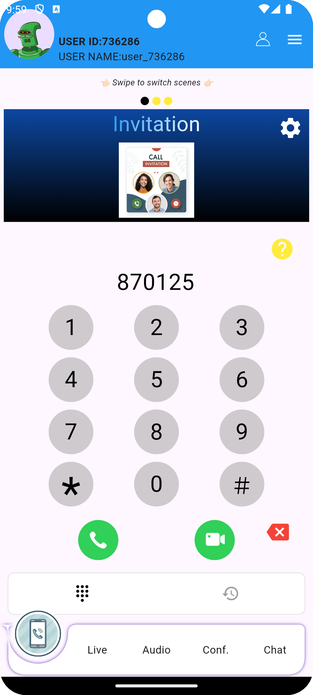
            <div>प्रत्यक्ष डायलिंग के माध्यम से दूसरे व्यक्ति को कॉल करें।</div>
        </div>
        <div style="display: inline-block; text-align: center; margin-right: 20px;">
            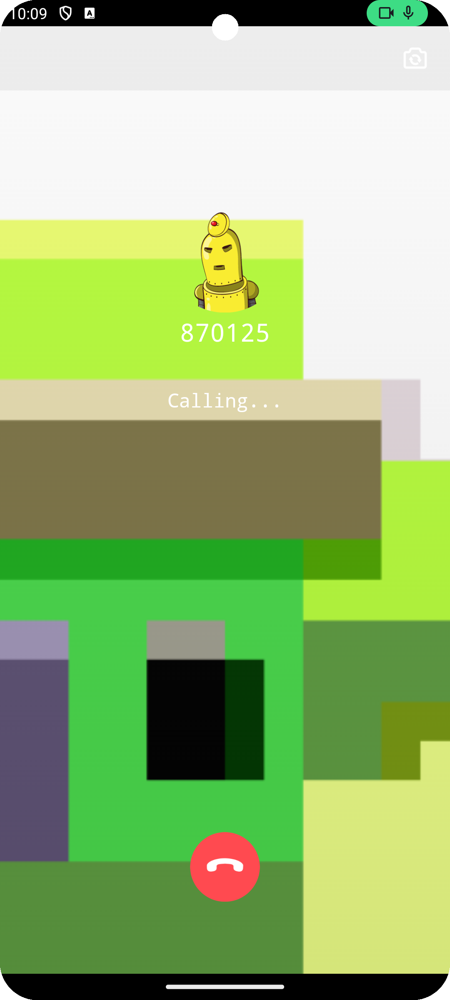
            <div>कॉलिंग इंटरफ़ेस (कॉलर)।</div>
        </div>
        <div style="display: inline-block; text-align: center; margin-right: 20px;">
            
            <div>कॉलिंग इंटरफ़ेस (प्राप्तकर्ता)।</div>
        </div>
        <div style="display: inline-block; text-align: center; margin-right: 20px;">
            
            <div>कॉलिंग इंटरफ़ेस (प्राप्तकर्ता)।</div>
        </div>
        <div style="display: inline-block; text-align: center; margin-right: 20px;">
            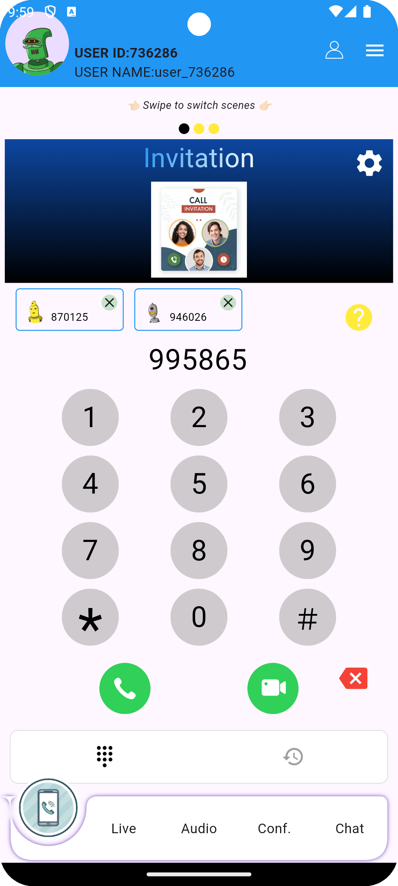
            <div>"#" कुंजी दबाकर कॉल करने वालों की संख्या बढ़ाई जा सकती है, समूह कॉल के लिए।</div>
        </div>
        <div style="display: inline-block; text-align: center; margin-right: 20px;">
            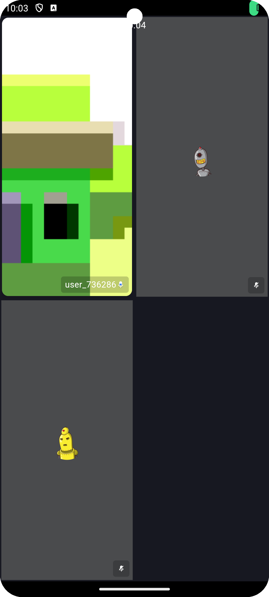
            <div>समूह कॉलिंग इंटरफ़ेस (कॉलर)।</div>
        </div>
    </div>

  - कॉल इतिहास
  - संपर्क
    <div style="overflow-x: auto; white-space: nowrap;">
        <div style="display: inline-block; text-align: center; margin-right: 20px;">
            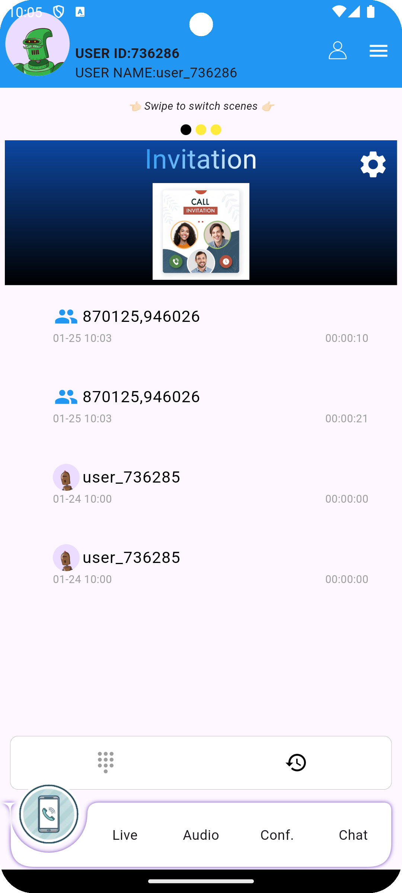
            <div>कॉल लॉग से सीधे दूसरे व्यक्ति को कॉल बैक करें।</div>
        </div>
        <div style="display: inline-block; text-align: center; margin-right: 20px;">
            
            <div>ऊपरी टूलबार में संपर्कों से सीधे दूसरे व्यक्ति को कॉल करें।</div>
        </div>
    </div>

- 1v1/समूह
  - पूर्व निर्धारित कॉल रूम सूची
    आप कॉल सेटिंग्स पृष्ठ में कॉल रूम सूची कॉन्फ़िगर कर सकते हैं, और जो लोग समान कॉल में प्रवेश करते हैं, वे आपस में बातचीत कर सकते हैं।
    <div style="overflow-x: auto; white-space: nowrap;">
        <div style="display: inline-block; text-align: center; margin-right: 20px;">
            
            <div>पूर्व निर्धारित कॉल (1v1) में सीधे प्रवेश करें।</div>
        </div>
        <div style="display: inline-block; text-align: center; margin-right: 20px;">
            
            <div>पूर्व निर्धारित कॉल (समूह) में सीधे प्रवेश करें।</div>
        </div>
    </div>

- लाइव
  - लाइव स्ट्रीमिंग
    <div style="overflow-x: auto; white-space: nowrap;">
        <div style="display: inline-block; text-align: center; margin-right: 20px;">
            
            <div>पूर्व निर्धारित लाइव सूची।</div>
        </div>
        <div style="display: inline-block; text-align: center; margin-right: 20px;">
            
            <div>होस्ट पूर्वावलोकन पृष्ठ।</div>
        </div>
        <div style="display: inline-block; text-align: center; margin-right: 20px;">
            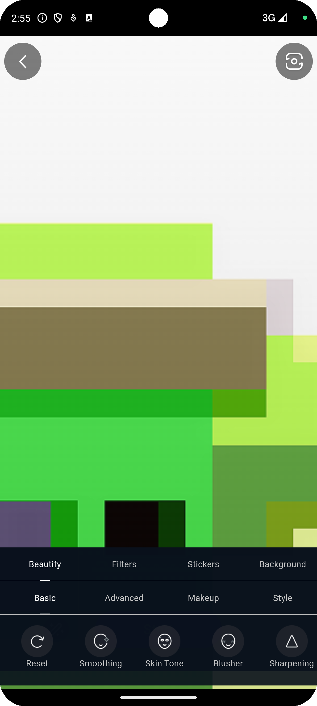
            <div>ब्यूटी फ़िल्टर।</div>
        </div>
        <div style="display: inline-block; text-align: center; margin-right: 20px;">
            
            <div>सह-होस्ट।</div>
        </div>
        <div style="display: inline-block; text-align: center; margin-right: 20px;">
            
            <div>सदस्य सूची।</div>
        </div>
    </div>
  - PK
    <div style="overflow-x: auto; white-space: nowrap;">
        <div style="display: inline-block; text-align: center; margin-right: 20px;">
            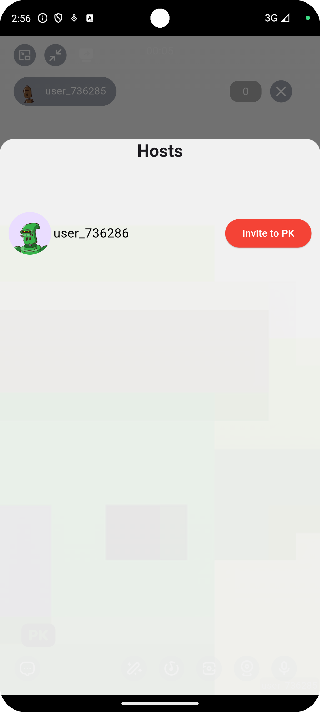
            <div>ऑनलाइन फ्री होस्ट सूची।</div>
        </div>
        <div style="display: inline-block; text-align: center; margin-right: 20px;">
            
            <div>होस्ट को PK के लिए आमंत्रित किया गया।</div>
        </div>
        <div style="display: inline-block; text-align: center; margin-right: 20px;">
            
            <div>कुछ होस्ट की स्थिति PK आमंत्रण में है।</div>
        </div>
        <div style="display: inline-block; text-align: center; margin-right: 20px;">
            
            <div>कुछ होस्ट की स्थिति PK में है।</div>
        </div>
        <div style="display: inline-block; text-align: center; margin-right: 20px;">
            
            <div>डिफ़ॉल्ट PK इंटरफ़ेस।</div>
        </div> 
    </div>
  - लाइव सूची
    <div style="overflow-x: auto; white-space: nowrap;">
        <div style="display: inline-block; text-align: center; margin-right: 20px;">
            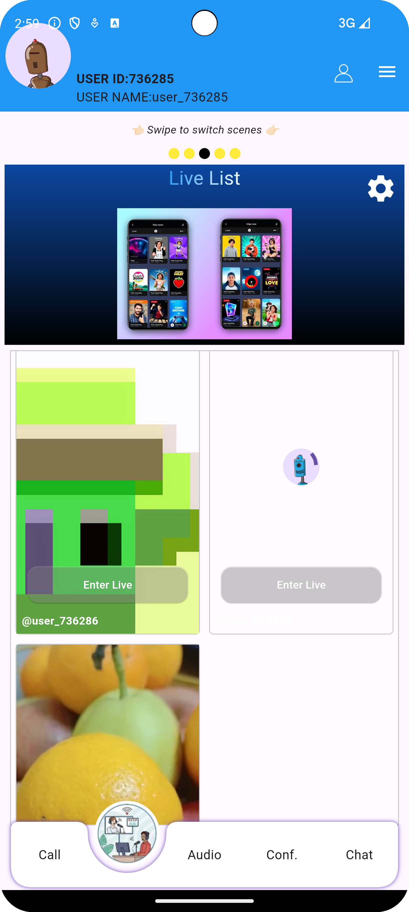
        </div>
    </div>
  - स्वाइप स्विचिंग
  - मल्टीमीडिया शेयरिंग
    <div style="overflow-x: auto; white-space: nowrap;">
        <div style="display: inline-block; text-align: center; margin-right: 20px;">
            
            <div>होस्ट एक फिल्म साझा करता है।</div>
        </div>
        <div style="display: inline-block; text-align: center; margin-right: 20px;">
            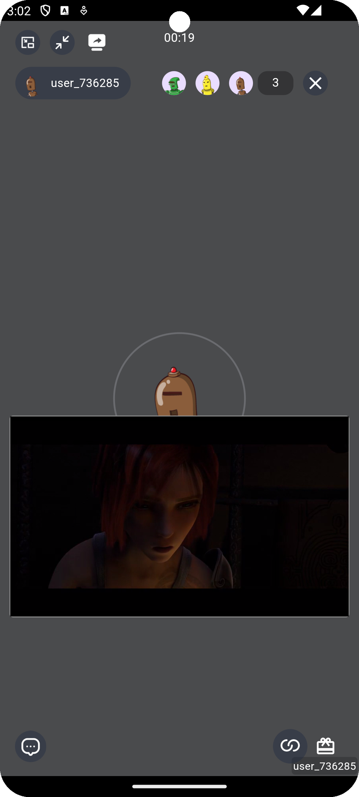
            <div>दर्शक होस्ट को फिल्म समझाते हुए देखते हैं।</div>
        </div>
    </div>

- ऑडियो रूम
  - पूर्व निर्धारित रूम सूची
    <div style="overflow-x: auto; white-space: nowrap;">
        <div style="display: inline-block; text-align: center; margin-right: 20px;">
            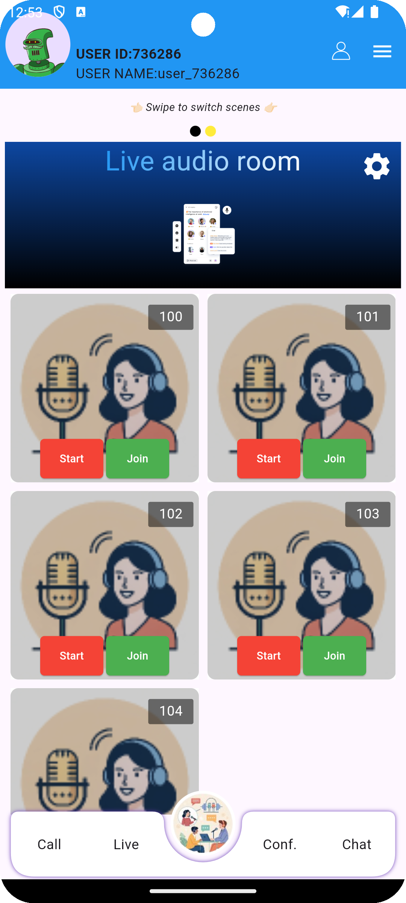
        </div>
        <div style="display: inline-block; text-align: center; margin-right: 20px;">
            
        </div>
    </div>
  - मल्टीमीडिया शेयरिंग
    <div style="overflow-x: auto; white-space: nowrap;">
        <div style="display: inline-block; text-align: center; margin-right: 20px;">
            
        </div>
        <div style="display: inline-block; text-align: center; margin-right: 20px;">
            
            <div>होस्ट एक फिल्म चला रहा है।</div>
        </div>
        <div style="display: inline-block; text-align: center; margin-right: 20px;">
            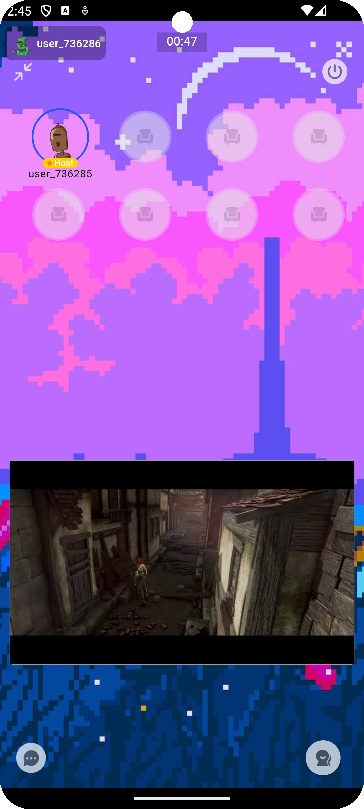
            <div>अन्य उपयोगकर्ता।</div>
        </div>
    </div>

- सम्मेलन
  - पूर्व निर्धारित रूम सूची
    <div style="overflow-x: auto; white-space: nowrap;">
        <div style="display: inline-block; text-align: center; margin-right: 20px;">
            
        </div>
        <div style="display: inline-block; text-align: center; margin-right: 20px;">
            
        </div>
        <div style="display: inline-block; text-align: center; margin-right: 20px;">
            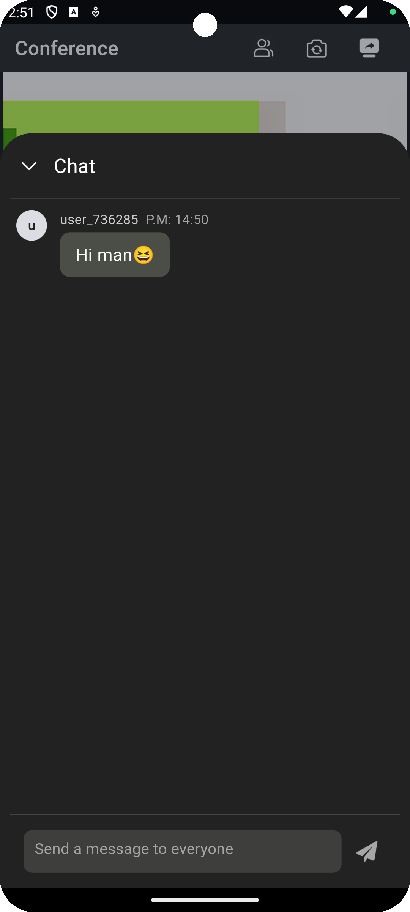
            <div>चैट इंटरफ़ेस।</div>
        </div>
    </div>
  - स्क्रीन साझा करना
    <div style="overflow-x: auto; white-space: nowrap;">
        <div style="display: inline-block; text-align: center; margin-right: 20px;">
            
            <div>किसी और की स्क्रीन साझा करते हुए देखें।</div>
        </div>
        <div style="display: inline-block; text-align: center; margin-right: 20px;">
            
            <div>स्क्रीन साझा कर रहा है।</div>
        </div>
    </div>

- चैट
    <div style="overflow-x: auto; white-space: nowrap;">
        <div style="display: inline-block; text-align: center; margin-right: 20px;">
            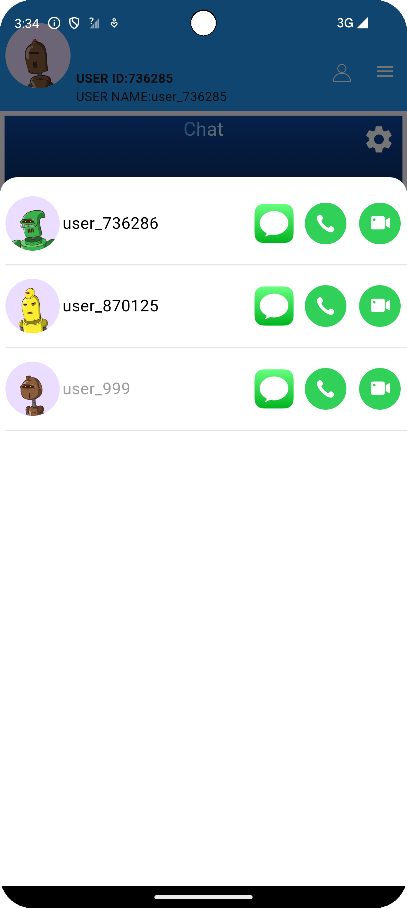
            <div>पते की किताब से संपर्क चुनें।</div>
        </div>
        <div style="display: inline-block; text-align: center; margin-right: 20px;">
            
            <div>अन्य उपयोगकर्ताओं से संदेश प्राप्त करें।</div>
        </div>
        <div style="display: inline-block; text-align: center; margin-right: 20px;">
            
            <div>संदेश सूची।</div>
        </div>
    </div>