- [中文](README.zh.md)
- [हिन्दी](README.hi.md)

# Code Structure

```
lib/
├── app.dart                 # Application entry and global configuration
├── main.dart               # Main program entry
├── firebase_options.dart   # Firebase configuration
├── common/                 # Common components and utilities
├── data/                   # Data models and state management
├── firestore/             # Firestore database operations
├── kits/                  # ZEGO UI Kits integration
│   ├── call/             # Call functionality
│   │   ├── call_page.dart        # Call page
│   │   ├── call_invitation.dart  # Call invitation
│   │   └── call_settings.dart    # Call settings
│   ├── live_streaming/   # Live streaming functionality
│   │   ├── live_page.dart       # Live page
│   │   ├── pk_page.dart         # PK functionality
│   │   └── live_settings.dart   # Live settings
│   ├── audio_room/       # Audio chat room
│   │   ├── audio_room_page.dart    # Audio room page
│   │   └── audio_room_settings.dart # Audio room settings
│   ├── conference/       # Video conference
│   │   ├── conference_page.dart    # Conference page
│   │   └── conference_settings.dart # Conference settings
│   ├── chat/             # Instant messaging
│   │   ├── chat_page.dart      # Chat page
│   │   └── chat_settings.dart  # Chat settings
│   ├── cache.dart        # Cache management
│   ├── room_list.dart    # Room list management
│   ├── express_event_handler.dart # Event handling
│   └── kits_page.dart    # Kits page management
└── pages/                # Page components
    ├── splash.dart       # Splash page
    ├── loading.dart      # Loading page
    ├── login.dart        # Login page
    ├── home.dart         # Home page
    ├── settings.dart     # Settings page
    ├── about.dart        # About page
    ├── contact.dart      # Contact page
    ├── feedback.dart     # Feedback page
    ├── more_drawer.dart  # More drawer menu
    └── utils/            # Page utilities
        └── ...          # Page-related utility functions and components
```

# Introduction

demo of zego-uikits

- [call](https://pub.dev/packages/zego_uikit_prebuilt_call)
- [live](https://pub.dev/packages/zego_uikit_prebuilt_live_streaming)
- [audio room](https://pub.dev/packages/zego_uikit_prebuilt_live_audio_room)
- [conference](https://pub.dev/packages/zego_uikit_prebuilt_video_conference)
- [chat](https://pub.dev/packages/zego_zimkit)

The demo introduces the basic functions of five kits, linking virtual users together simply through Firestore.

A purely personal project powered by love:
1. No version plans, please like and encourage.
2. No technical support, please raise issues for bugs and feature requests.

# Getting Started

Before using, you need to register Firestore and ZEGO AppID/AppSign.

1. Firestore

   - Related Features: Contacts, Live PK host list
   - Set up Firebase project:
     - Create a Firebase project:
       Visit [Firebase Console](https://console.firebase.google.com/u/0/) and create a new project.
     - Enable Firestore:
       In the project, navigate to the "Firestore Database" section, select Create Database, and then select Start in Test Mode.
       Set the rules on the rules page:
       ```terminal
       rules_version = '2';

       service cloud.firestore {
           match /databases/{database}/documents {
               match /{document=**} {
               allow read, write: if true;
               }
           }
       }
       ```
   - Download your own Google services file, then replace `./android/app/google-services.json` and `./ios/Runner/GoogleService-Info.plist` respectively.
   - follow the instructions on [Add Firebase to your Flutter app](https://firebase.google.com/docs/flutter/setup?platform=ios)
2. AppID/AppSign of Zego
   Go to [ZEGOCLOUD Admin Console](https://console.zegocloud.com/), get the appID and appSign of your project.
   Then set it in the demo's system settings interface.
3. Configure Offline Calls (Optional)
   Please follow the steps in **1. Firebase Console and ZEGO Console Configuration** section of [Configure your project](https://www.zegocloud.com/docs/uikit/callkit-flutter/quick-start-(with-call-invitation)#configure-your-project).

# Feature Introduction

## splash
  A brief introduction to the basic functions of the five kits.
  <div style="overflow-x: auto; white-space: nowrap;">
        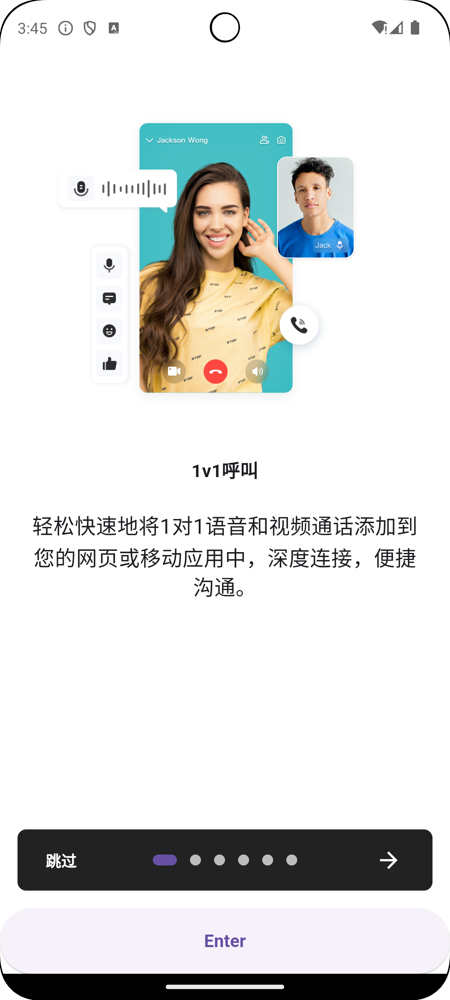
        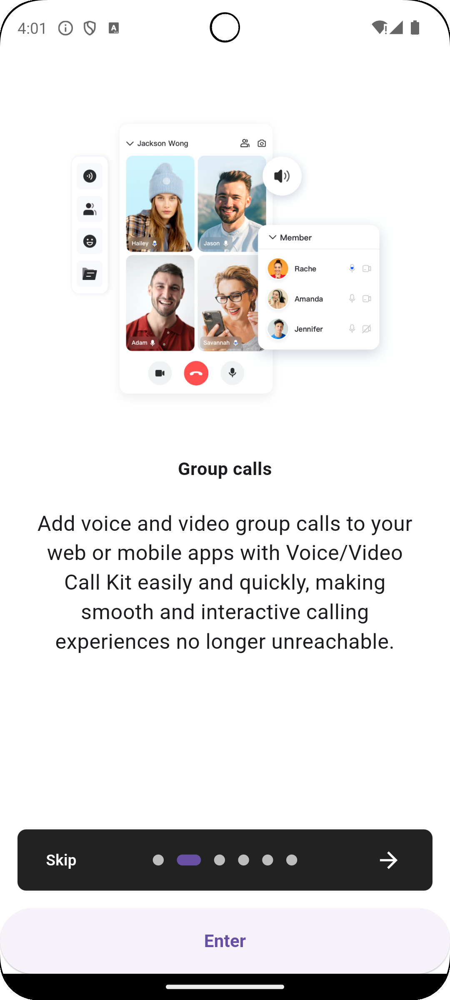
        
        
        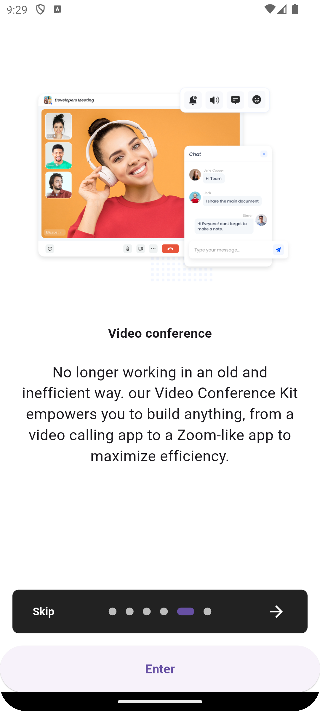
        
    </div>

## global settings
  You need to set **ZEGO AppID/AppSign** here, and you can also **switch languages** here.
  <div style="overflow-x: auto; white-space: nowrap;">
        
        
    </div>

## call
  
- Settings
    <div style="overflow-x: auto; white-space: nowrap;">
        <div style="display: inline-block; text-align: center; margin-right: 20px;">
            
            <div>Click the settings button in the upper right corner to enter the settings interface, where you can make some dynamic configurations.</div>
        </div>
    </div>

- Call Invitation

  - Dial Call
    <div style="overflow-x: auto; white-space: nowrap;">
        <div style="display: inline-block; text-align: center; margin-right: 20px;">
            
            <div>Call the other party by direct dialing.</div>
        </div>
        <div style="display: inline-block; text-align: center; margin-right: 20px;">
            
            <div>Calling interface (caller).</div>
        </div>
        <div style="display: inline-block; text-align: center; margin-right: 20px;">
            
            <div>Calling interface (recipient).</div>
        </div>
        <div style="display: inline-block; text-align: center; margin-right: 20px;">
            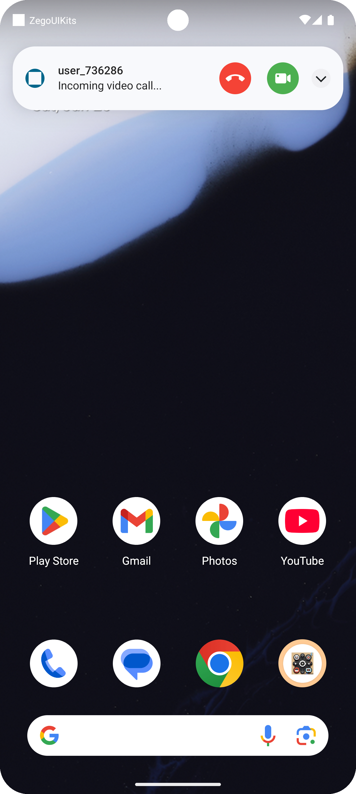
            <div>Calling interface (recipient).</div>
        </div>
        <div style="display: inline-block; text-align: center; margin-right: 20px;">
            
            <div>Press the " # " key to increase the number of callers for a group call.</div>
        </div>
        <div style="display: inline-block; text-align: center; margin-right: 20px;">
            
            <div>Group calling interface (caller).</div>
        </div>
    </div>

  - Call History
  - Contacts
    <div style="overflow-x: auto; white-space: nowrap;">
        <div style="display: inline-block; text-align: center; margin-right: 20px;">
            
            <div>Directly call back the other party from the call log.</div>
        </div>
        <div style="display: inline-block; text-align: center; margin-right: 20px;">
            
            <div>Directly call the other party from the contacts in the top toolbar.</div>
        </div>
    </div>

- 1v1/group
  - Preset Call Room List
    You can configure the call room list in the call settings page, and those entering the same call can converse with each other.
    <div style="overflow-x: auto; white-space: nowrap;">
        <div style="display: inline-block; text-align: center; margin-right: 20px;">
            
            <div>Directly enter the preset call (1v1) from the preset call list.</div>
        </div>
        <div style="display: inline-block; text-align: center; margin-right: 20px;">
            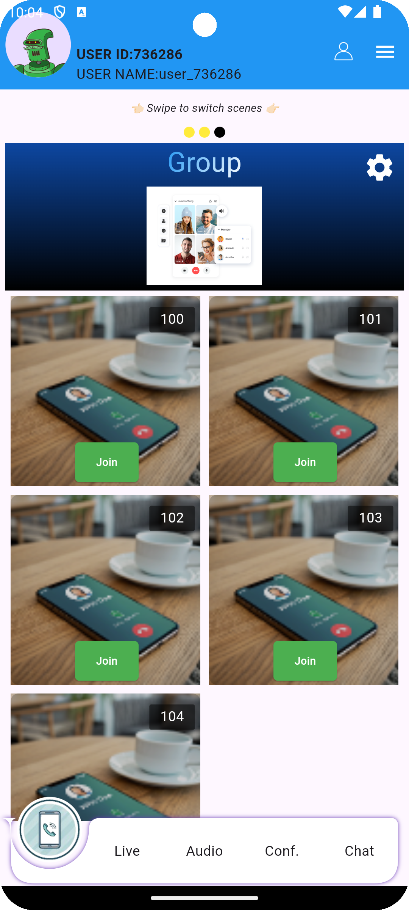
            <div>Directly enter the preset call (group) from the preset call list.</div>
        </div>
    </div>

- live
  - Live Streaming
    <div style="overflow-x: auto; white-space: nowrap;">
        <div style="display: inline-block; text-align: center; margin-right: 20px;">
            
            <div>Preset live list.</div>
        </div>
        <div style="display: inline-block; text-align: center; margin-right: 20px;">
            
            <div>Host preview page.</div>
        </div>
        <div style="display: inline-block; text-align: center; margin-right: 20px;">
            
            <div>Beauty filter.</div>
        </div>
        <div style="display: inline-block; text-align: center; margin-right: 20px;">
            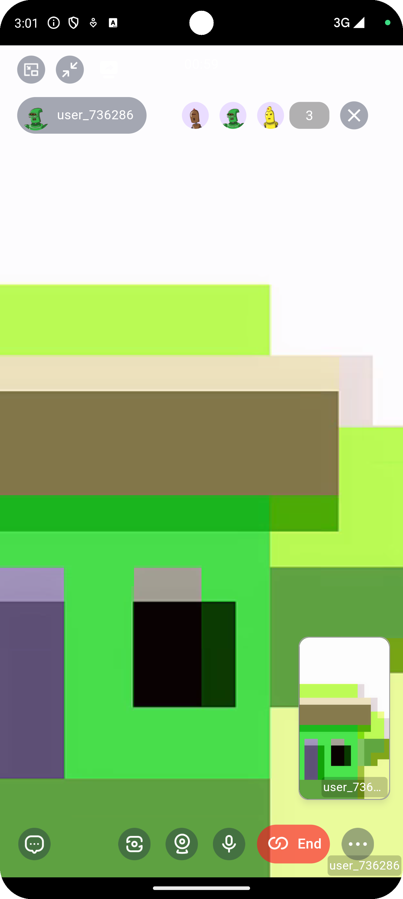
            <div>Co-host.</div>
        </div>
        <div style="display: inline-block; text-align: center; margin-right: 20px;">
            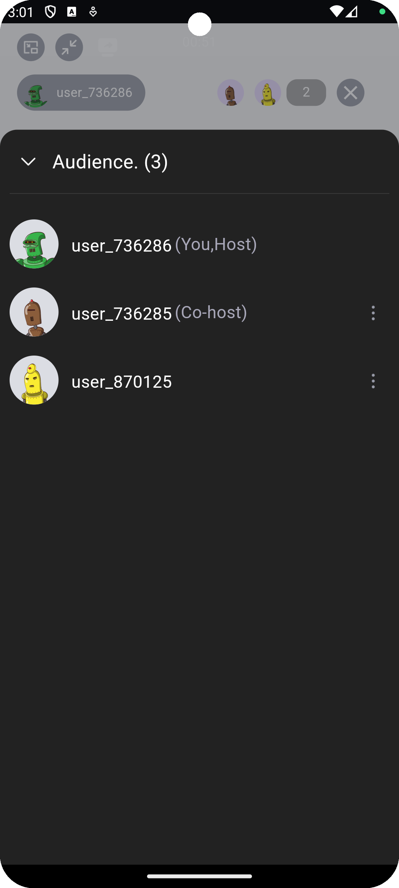
            <div>Member list.</div>
        </div>
    </div>
  - PK
    <div style="overflow-x: auto; white-space: nowrap;">
        <div style="display: inline-block; text-align: center; margin-right: 20px;">
            
            <div>Online idle host list.</div>
        </div>
        <div style="display: inline-block; text-align: center; margin-right: 20px;">
            
            <div>Host invited for PK.</div>
        </div>
        <div style="display: inline-block; text-align: center; margin-right: 20px;">
            
            <div>Some host status shows PK invitation in progress.</div>
        </div>
        <div style="display: inline-block; text-align: center; margin-right: 20px;">
            
            <div>Some host status shows PK in progress.</div>
        </div>
        <div style="display: inline-block; text-align: center; margin-right: 20px;">
            
            <div>Default PK interface.</div>
        </div> 
    </div>
  - Live List
    <div style="overflow-x: auto; white-space: nowrap;">
        <div style="display: inline-block; text-align: center; margin-right: 20px;">
            
        </div>
    </div>
  - Swipe Switching
  - Multimedia Sharing
    <div style="overflow-x: auto; white-space: nowrap;">
        <div style="display: inline-block; text-align: center; margin-right: 20px;">
            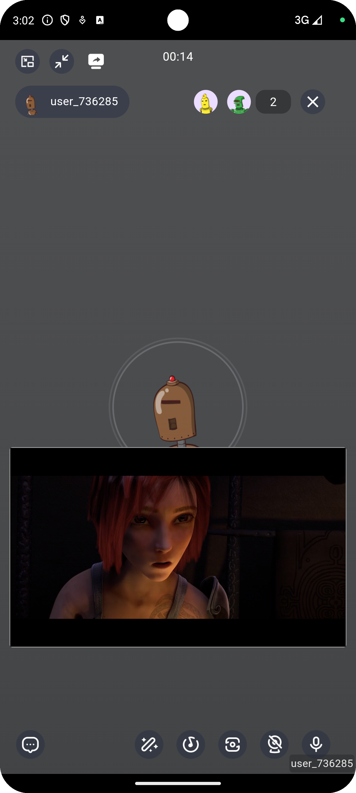
            <div>Host shares a movie.</div>
        </div>
        <div style="display: inline-block; text-align: center; margin-right: 20px;">
            
            <div>Audience watches the host explain the movie.</div>
        </div>
    </div>

- audio room
  - Preset Room List
    <div style="overflow-x: auto; white-space: nowrap;">
        <div style="display: inline-block; text-align: center; margin-right: 20px;">
            
        </div>
        <div style="display: inline-block; text-align: center; margin-right: 20px;">
            
        </div>
    </div>
  - Multimedia Sharing
    <div style="overflow-x: auto; white-space: nowrap;">
        <div style="display: inline-block; text-align: center; margin-right: 20px;">
            
        </div>
        <div style="display: inline-block; text-align: center; margin-right: 20px;">
            
            <div>Host plays a movie.</div>
        </div>
        <div style="display: inline-block; text-align: center; margin-right: 20px;">
            
            <div>Other users.</div>
        </div>
    </div>

- conference
  - Preset Room List
    <div style="overflow-x: auto; white-space: nowrap;">
        <div style="display: inline-block; text-align: center; margin-right: 20px;">
            
        </div>
        <div style="display: inline-block; text-align: center; margin-right: 20px;">
            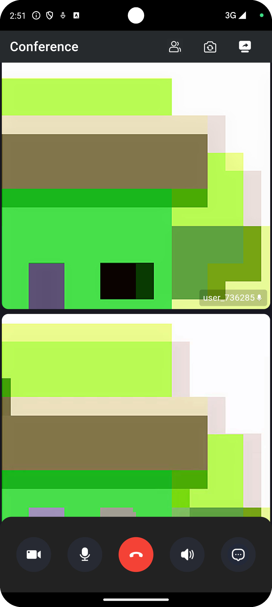
        </div>
        <div style="display: inline-block; text-align: center; margin-right: 20px;">
            
            <div>Chat interface.</div>
        </div>
    </div>
  - Screen Sharing
    <div style="overflow-x: auto; white-space: nowrap;">
        <div style="display: inline-block; text-align: center; margin-right: 20px;">
            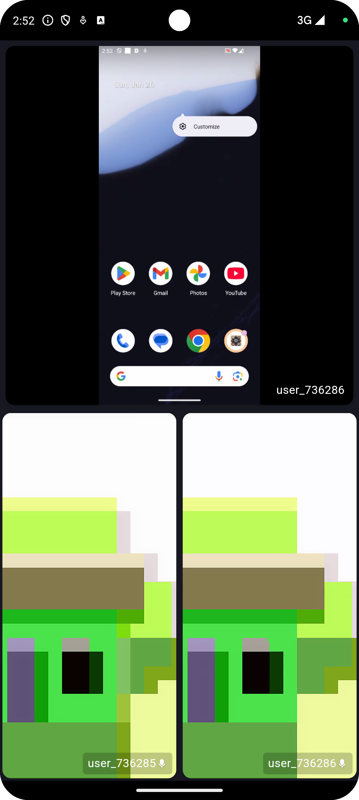
            <div>Watch someone else's screen sharing.</div>
        </div>
        <div style="display: inline-block; text-align: center; margin-right: 20px;">
            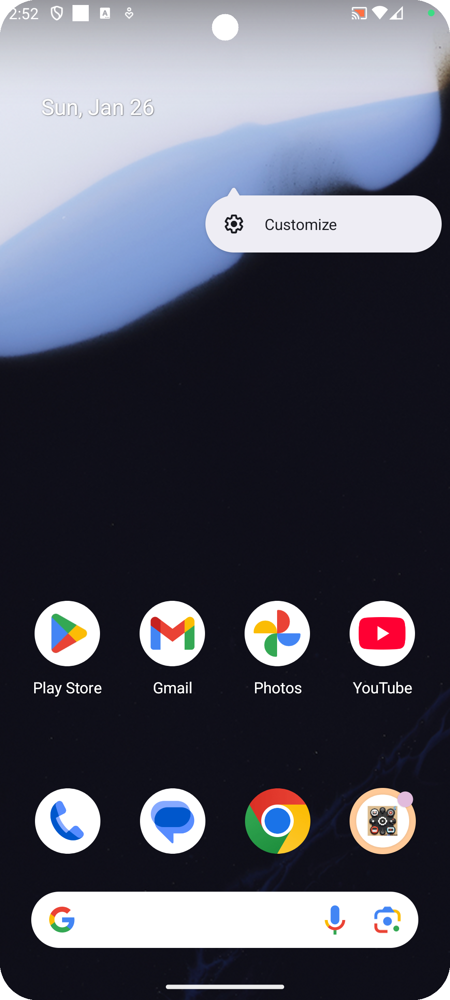
            <div>Currently sharing screen.</div>
        </div>
    </div>

- chat
    <div style="overflow-x: auto; white-space: nowrap;">
        <div style="display: inline-block; text-align: center; margin-right: 20px;">
            
            <div>Select contacts from the address book.</div>
        </div>
        <div style="display: inline-block; text-align: center; margin-right: 20px;">
            
            <div>Received messages from other users.</div>
        </div>
        <div style="display: inline-block; text-align: center; margin-right: 20px;">
            
            <div>Message list.</div>
        </div>
    </div>