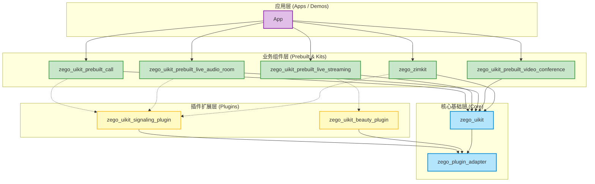

# Zego UIKit Project Structure Analysis

本文档旨在分析 `zego_uikits` 仓库中各个库和 Demo 之间的层级与依赖关系。

## 1. 整体架构概览

该仓库采用 Monorepo 结构管理多个 Flutter 包，这些包共同构成了 ZegoCloud 的低代码（Low-Code）解决方案。整体架构可以分为三层：**核心基础层**、**插件扩展层**和**业务组件层**。

### 架构分层图

---

## 2. 各层级库详细说明

### Level 1: 核心基础层 (Core Layer)

这是所有上层组件的基础，提供了最底层的 UI 组件和插件适配能力。

*   **`zego_uikit`**
    *   **定位**: 核心 UI 库。
    *   **功能**: 提供基础的音视频 UI 组件（如 `AudioVideoView`, `CameraButtons` 等），直接封装了 Zego Express Engine (Native SDK)。
    *   **依赖**: `zego_plugin_adapter`
    *   **适用场景**: 需要高度自定义 UI，但不想直接处理底层 SDK 复杂逻辑的开发者。

*   **`zego_plugin_adapter`**
    *   **定位**: 插件适配器。
    *   **功能**: 定义了插件的通用接口，用于连接 `zego_uikit` 和各种功能插件（如美颜、信令）。
    *   **适用场景**: 内部底层库，通常不需要直接使用。

### Level 2: 插件扩展层 (Plugin Layer)

这一层为 `zego_uikit` 提供额外的能力扩展，如信令控制和高级美颜。

*   **`zego_uikit_signaling_plugin`**
    *   **定位**: 信令插件。
    *   **功能**: 基于 ZIM (Zego Instant Messaging) 封装，提供呼叫邀请、房间管理、用户状态同步等信令能力。
    *   **依赖**: `zego_plugin_adapter`, `zego_zim`, `zego_callkit`
    *   **适用场景**: 需要实现呼叫邀请、用户状态同步的应用。

*   **`zego_uikit_beauty_plugin`**
    *   **定位**: 美颜插件。
    *   **功能**: 提供高级美颜、滤镜、贴纸等特效。
    *   **依赖**: `zego_plugin_adapter`, `zego_effects_plugin`
    *   **适用场景**: 直播、视频通话等需要美颜功能的场景。

### Level 3: 业务组件层 (Business Kit Layer)

这一层是“开箱即用”的完整业务场景解决方案（Prebuilt），开发者只需几行代码即可集成完整的业务功能。

*   **`zego_uikit_prebuilt_call`**
    *   **场景**: 1v1 或群组音视频通话。
    *   **功能**: 包含呼叫邀请、通话界面、设备管理等。
    *   **核心依赖**: `zego_uikit`, `zego_uikit_signaling_plugin`

*   **`zego_uikit_prebuilt_live_streaming`**
    *   **场景**: 互动直播。
    *   **功能**: 主播开播、观众连麦、弹幕互动、美颜等。
    *   **核心依赖**: `zego_uikit`, `zego_plugin_adapter`

*   **`zego_uikit_prebuilt_live_audio_room`**
    *   **场景**: 语聊房。
    *   **功能**: 麦位管理、多人语音聊天、表情互动。
    *   **核心依赖**: `zego_uikit`, `zego_uikit_signaling_plugin`

*   **`zego_uikit_prebuilt_video_conference`**
    *   **场景**: 视频会议。
    *   **功能**: 动态布局、成员列表、屏幕共享等。
    *   **核心依赖**: `zego_uikit`

*   **`zego_zimkit`**
    *   **场景**: 即时通讯 (IM)。
    *   **功能**: 这是一个相对独立的 Kit，专注于聊天界面（单聊、群聊）。
    *   **核心依赖**: `zego_uikit_signaling_plugin`, `zego_zim`

---

## 3. Demo 与 Example 说明

在根目录下**没有统一的 `demo` 目录**。每个库都遵循 Flutter Package 的标准结构，包含独立的 `example` 目录用于演示该库的用法。

如果您想运行 Demo，请前往对应库的 `example` 目录：

| 库名称 | Demo 位置 | 说明 |
| :--- | :--- | :--- |
| **Call (通话)** | `zego_uikit_prebuilt_call/example` | 演示 1v1 及群组通话、呼叫邀请 |
| **Live Streaming (直播)** | `zego_uikit_prebuilt_live_streaming/example` | 演示直播推拉流、连麦互动 |
| **Audio Room (语聊房)** | `zego_uikit_prebuilt_live_audio_room/example` | 演示多人语音聊天室 |
| **Conference (会议)** | `zego_uikit_prebuilt_video_conference/example` | 演示视频会议功能 |
| **ZIMKit (聊天)** | `zego_zimkit/example` | 演示 IM 聊天界面 |
| **UIKit (基础)** | `zego_uikit/example` | 演示基础组件的使用 |

## 4. 总结

*   **`zego_uikit`** 是地基。
*   **Plugins** 是在此地基上加装的特殊功能模块（信令、美颜）。
*   **Prebuilt Kits** 是装修好的完整房间，直接入住（集成）即可。

开发者应根据需求选择：
*   **最快集成**: 选择 `prebuilt` 系列库。
*   **需要自定义**: 使用 `zego_uikit` 配合 Plugins 自行组装。
